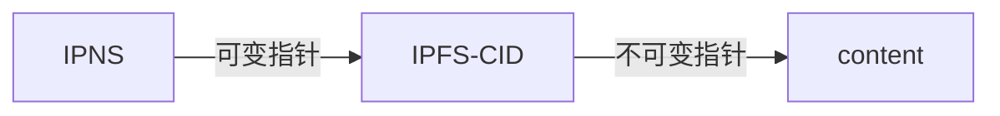
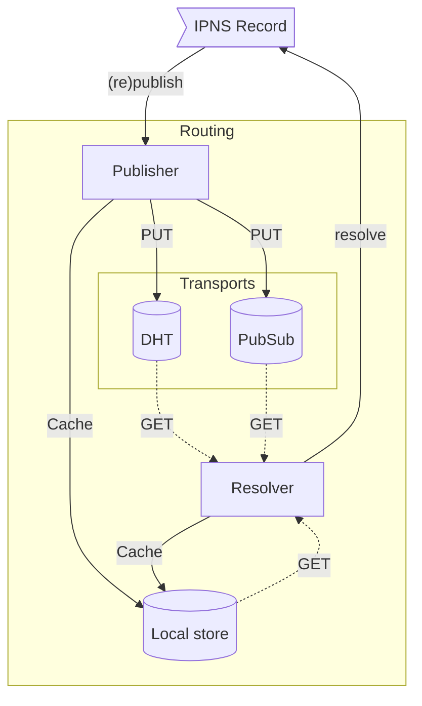

# 星际名称系统 (IPNS)

- [星际名称系统 (IPNS)](#interplanetary-name-system-ipns)
  - [IPFS 中的可变性](#IPFS中的可变性)
  - [IPNS 的工作原理](#how-ipns-works)
    - [IPNS 名称的剖析](#anatomy-of-an-ipns-name)
      - [IPNS 名称与内容路径的关系](#how-ipns-names-relate-to-content-paths)
    - [IPNS 名称是自我认证的](#ipns-names-are-self-certifying)
    - [常见 IPNS 操作](#common-ipns-operations)
    - [IPNS 与传输无关](#ipns-is-transport-agnostic)
      - [DHT 上的 IPNS](#ipns-over-the-dht)
      - [PubSub 上的 IPNS](#ipns-over-pubsub)
        - [在 PubSub 生命周期内发布 IPNS 记录](#publishing-ipns-records-over-pubsub-lifecycle)
    - [一致性与可用性之间的权衡](#tradeoffs-between-consistency-vs-availability)
      - [IPNS 记录有效性](#ipns-record-validity)
      - [实际考虑](#practical-considerations)
  - [IPNS 实践](#ipns-in-practice)
    - [使用 IPFS 网关解析 IPNS 名称](#resolving-ipns-names-using-ipfs-gateways)
    - [发布 IPNS 名称](#publishing-ipns-names)
  - [IPNS 的替代方案](#alternatives-to-ipns)
  - [更多资源](#further-resources)

## IPFS 中的可变性

IPFS 中的 [内容寻址](content-addressing.md) 本质上是 _不可变的_：当您将文件添加到 IPFS 时，它会根据数据创建一个哈希，并以此构建 CID。更改文件会更改其哈希，从而更改用作地址的 CID。

然而，在很多情况下，内容寻址数据需要定期更新，例如，发布一个经常更改的网站。每次更新网站时都共享一个新的 CID 是不切实际的。使用 **可变指针**，您可以共享一次指针的地址，并在每次发布更改时将指针更新为新的 CID。

星际名称系统 (IPNS) 是一种用于创建指向 CID 的可变指针（称为 **names** 或 **IPNS names**）的系统。IPNS 名称可视为可随时间更新的链接，同时保留内容寻址的可验证性。

::: callout
IPNS 名称可以指向任意内容路径（`/ipfs/` 或 `/ipns/`），*包括另一个 IPNS 名称或 DNSLink 路径*。但是，它通常指向完全解析且不可变的路径，即 `/ipfs/[CID]`。
:::

## IPNS 的工作原理

### IPNS 名称的剖析

IPNS 中的 **名称** 是公钥的 [哈希](hashing.md)。它与一个 [**IPNS 记录**](https://github.com/ipfs/specs/blob/main/ipns/IPNS.md#ipns-record) 相关联，其中包含它链接到的内容路径 (`/ipfs/CID`) 以及其他信息，例如到期日期、版本号以及由相应私钥签名的加密签名。私钥持有者可以随时签署和发布新记录。

例如，以下是用公钥的 CIDv1 表示的 IPNS 名称： [`k51qzi5uqu5dlvj2baxnqndepeb86cbk3ng7n3i46uzyxzyqj2xjonzllnv0v8`](https://cid.ipfs.tech/#k51qzi5uqu5dlvj2baxnqndepeb86cbk3ng7n3i46uzyxzyqj2xjonzllnv0v8).

> **Note:** Kubo 使用 `self` 密钥（用于 PeerID 的 ed25519 私钥）作为默认 IPNS 名称。但可以通过 [`ipfs key gen`](https://docs.ipfs.tech/reference/kubo/cli/#ipfs-key-gen) 生成多个密钥，并使用它们来管理多个 IPNS 名称。

#### IPNS 名称与内容路径的关系

IPNS 记录可以指向不可变或可变的路径。路径中使用的 CID 背后的含义取决于使用的命名空间：

- `/ipfs/<cid>` – [IPFS 上的不可变内容](https://cid.ipfs.tech/#bafybeibml5uieyxa5tufngvg7fgwbkwvlsuntwbxgtskoqynbt7wlchmfm)（因为 CID 包含多重哈希）
- `/ipns/<cid-of-libp2p-key>` – 一个可变的、加密的 [IPNS 名称](https://cid.ipfs.tech/#k51qzi5uqu5dlvj2baxnqndepeb86cbk3ng7n3i46uzyxzyqj2xjonzllnv0v8)，与 libp2p 公钥相对应。

以下是一个有用的思维模型，有助于理解两者之间的区别：



```
IPFS = immutable *Pointer => content
IPNS = **Pointer => content
```

IPNS 名称本质上是指向指针（IPFS CID）的指针（IPNS 名称），而 IPFS CID 是不可变的（因为它们源自内容）指向内容的指针。

### IPNS 名称是自我认证的

IPNS names are self-certifying. This means that an IPNS record contains all the information necessary to certify its authenticity. IPNS achieves this using public and private key pairs:

- Each IPNS name corresponds to a key pair
- The IPNS name is a CID with a multihash of the public key
- The IPNS record contains the public key and signature, allowing anyone to verify that the record was signed by the private key holder.

This self-certifying nature gives IPNS several benefits not present in hierarchical and consensus systems such as DNS, and blockchain identifiers. Notably, IPNS records can come from anywhere, not just a particular service/system, and it is very fast and easy to confirm a record is authentic.

### 常见 IPNS 操作

As a user or developer using IPNS for naming, there are three common operations worth understanding:

- **Updating/Creating an IPNS record:** refers to the creation of an IPNS record and signing it with a private key.
- **Publishing an IPNS record:** advertising the IPNS record so that other nodes can resolve it. Details depend on the transport.
- **Resolving an IPNS name:** Resolving an IPNS name to a content path.

### IPNS 与传输无关



The self-certifying nature of IPNS records means that they are not tied to a specific transport protocol. In practice, most IPFS implementations rely on the [**DHT**](dht.md) and [**libp2p PubSub**](https://docs.libp2p.io/concepts/publish-subscribe/) to publish and resolve IPNS records.

There are nuanced differences and trade-offs between the **DHT** and **PubSub** to be aware of.

The main qualitative difference between the two is that IPNS over the DHT publishes and resolves to a global shared state, whereas IPNS over PubSub uses messaging over topics (where each IPNS name has a unique topic) to publish to and resolve from **interested peers**.

The main implication of this difference is that IPNS operations (publishing and resolving) over the DHT can take longer than over PubSub, while potentially ensuring higher consistency (you resolve to the latest version).

> **Note:** This trade-off is best explained by [CAP theorem](https://en.wikipedia.org/wiki/CAP_theorem).

#### DHT 上的 IPNS

The DHT is the default transport mechanism for IPNS records in many IPFS implementations.

Due to the ephemeral nature of the DHT, peers forget records after 24 hours. This applies to any record in the DHT, irrespective of the `validity` (also referred to as `lifetime`) field in the IPNS record.

Therefore, IPNS records need to be regularly (re-)published to the DHT. Moreover, publishing to the DHT at regular intervals ensures that the IPNS name can be resolved even when there's high node churn (nodes coming and going.)

By default, Kubo will republish IPNS records to the DHT based on the [`Ipns.RepublishPeriod`](https://github.com/ipfs/kubo/blob/master/docs/config.md#ipnsrepublishperiod) configuration which defaults to 4 hours. [Republishing](https://github.com/ipfs/go-namesys/blob/1bf7d3d9cbe8f988b232b92288b24d25add85a00/republisher/repub.go#L130-L167) involves two steps:

1. Creating an updated IPNS record with the `validity` timestamp field updated (by default based on [`Ipns.RecordLifetime`](https://github.com/ipfs/kubo/blob/master/docs/config.md#ipnsrecordlifetime)), and signing it with the private key. The `sequence` number will only be incremented if the content path changes.
2. Publish the [IPNS record to the DHT](https://docs.ipfs.tech/concepts/dht/#ipns-records)

> **Note:** See the [DHT documentation](dht.md#ipns-records) for more information on the lifecycle of GETs and PUTs of IPNS records.

It's worth noting that publishing and resolving IPNS names using the DHT can be slow. This is because multiple records need to be found to ensure the latest version (record with the highest `sequence`), which involves round trips to multiple nodes.

#### PubSub 上的 IPNS

IPNS over PubSub uses the [Libp2p PubSub](https://docs.libp2p.io/concepts/publish-subscribe/) to publish records and resolve names amongst **interested peers**.

This is achieved by deriving the PubSub topic name from the IPNS name so that each IPNS name has a unique topic.

Because PubSub doesn't have the notion of persistence (messages are ephemeral and dropped after propagation), IPNS over PubSub [adds a persistence layer](https://github.com/ipfs/specs/blob/main/ipns/IPNS_PUBSUB.md#layering-persistence-onto-libp2p-pubsub) to ensure that IPNS records are always available to the network.

In Kubo, IPNS over PubSub is not enabled by default and can be enabled using the [`Ipns.UsePubsub`](https://github.com/ipfs/kubo/blob/master/docs/config.md#ipnsusepubsub) configuration.

Initial operations, e.g. resolving or publishing an IPNS name for the first time can take time as they involve a roundtrip to the DHT (to lookup or publish provider records for the topic).

After the subscription to the topic is established, PubSub usually improves both publishing and resolving times of IPNS by relying on interested peers for both operations.

It should be noted that there's an upper limit to the number of unique IPNS names you can resolve over PubSub, because for each name, a subscription is created which opens several (by default 6) network connections to mesh members.

##### 在 PubSub 生命周期内发布 IPNS 记录

1. Create a record and sign it.
2. Calculate PubSub topic name from IPNS name.
3. Join the topic by querying the DHT for the topic's provider records.
4. Publish the IPNS record to the topic.
5. Whenever [a new peer joins the topic](https://github.com/libp2p/go-libp2p-pubsub-router/blob/292d99457d224853706c5e49f8ddc112740a856a/pubsub.go#L538-L560) (specifically your mesh), ask them for the record. If they respond with a newer record, update it locally and publish the updated record to the topic.
6. Periodically (by default every 10 minutes) rebroadcast the IPNS record.

Steps 5 and 6 describe from a high level how IPNS record persistence is layered over PubSub by ensuring continuous propagation of the IPNS record in the face of node churn (nodes dropping in and out of the network).

> Further details about the IPNS over PubSub protocol can be found in the [IPNS over PubSub Spec](https://github.com/ipfs/specs/blob/main/ipns/IPNS_PUBSUB.md#protocol)

### 一致性与可用性之间的权衡

The self-certifying nature of IPNS comes with an inherent tradeoff between **consistency** and **availability**.

Consistency means ensuring that users resolve to the latest published IPNS record for the name (with the highest sequence number) at the cost of potentially not being able to resolve.

Availability means resolving to a valid IPNS record, at the cost of potentially resolving to an outdated record.

#### IPNS 记录有效性

When setting the `validity` (referred to as [`lifetime` by Kubo](https://github.com/ipfs/kubo/blob/master/docs/config.md#ipnsrecordlifetime)) field of an IPNS record, you typically need to choose whether you favor **consistency** (short validity period, e.g. 24 hours) or **availability** (long validity period, e.g. 1 month), due to the inherent trade-off between the two.

#### 实际考虑

One of the most important things to consider with IPNS names is **how frequently you intend on updating the name**.

Practically, two levers within your control determine where your IPNS name is on the spectrum between consistency and availability:

- **IPNS record validity:** longer validity will veer towards availability. Moreover, longer validity will reduce the dependence on the key holder (which for most purposes is stored on a single machine and rare shared) since the record can continue to persist without requiring the private key holder to sign a new record. Another benefit of a longer validity is that the transport can be delegated to other nodes or services (such as [w3name](https://staging.web3.storage/docs/how-tos/w3name/)), without compromising the private key.
- **Transport mechanism:** the DHT veers towards consistency while PubSub veers towards availability. However, with Kubo, IPNS names are always published to the DHT, while PubSub is opt-in. For most purposes, enabling PubSub is a net gain unless you hit the upper limit of connections as a result of too many PubSub subscriptions.

## IPNS 实践

### 使用 IPFS 网关解析 IPNS 名称

IPNS names can be resolved by [IPFS gateways](ipfs-gateway.md) in a _trusted_ fashion using both path resolution and subdomain resolution style:

- Path resolution: `https://ipfs.io/ipns/{ipns-name}`
- Subdomain resolution: `https://{ipns-name}.ipns.dweb.link`

> **Note** IPNS resolution via an IPFS gateway is **trusted** (in the sense of trusting the gateway) which means you delegate IPNS resolution to the gateway without any means to verify the authenticity response you get, i.e the content path and signature of the IPNS record.

<!-- ### Third-party providing/publishing w3name -->

### 发布 IPNS 名称

See the following guide on [publishing IPNS names with Kubo and Helia](../how-to/publish-ipns.md).

## IPNS 的替代方案

IPNS is not the only way to create mutable addresses on IPFS. You can also use [DNSLink](dnslink.md), which is currently much faster than IPNS, uses human-readable names, and can also point to IPNS names. Other community members are exploring ways to use blockchains to store common name records.

## 更多资源

- [ResNetLab on Tour - Mutable Content](https://research.protocol.ai/tutorials/resnetlab-on-tour/mutable-content/)
